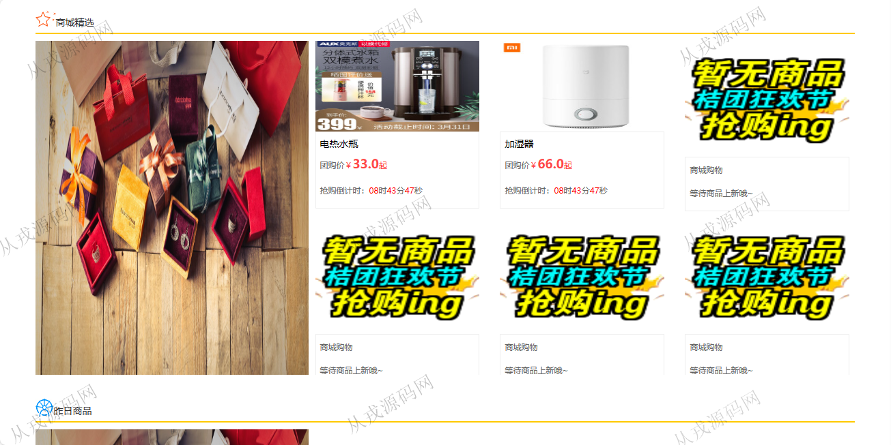
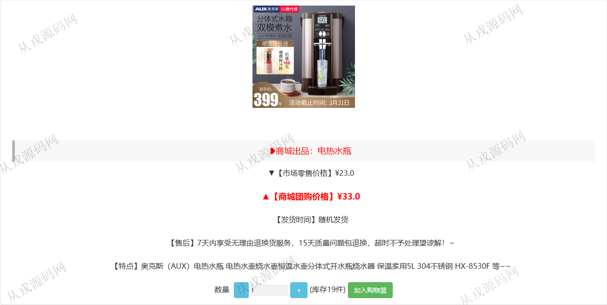
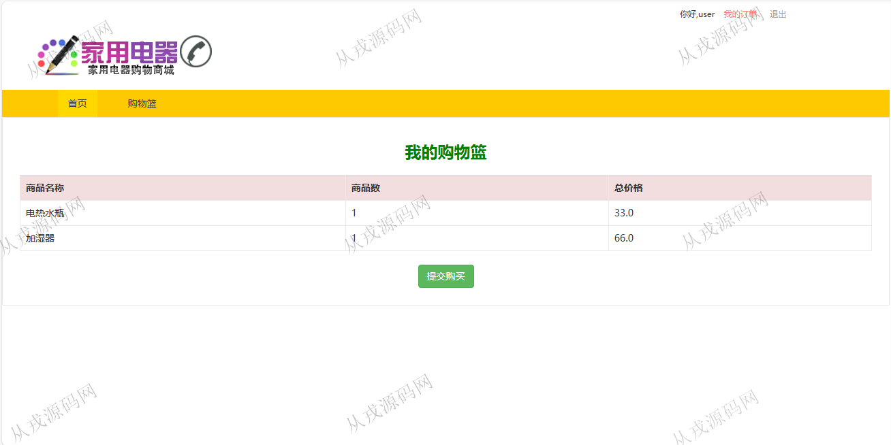
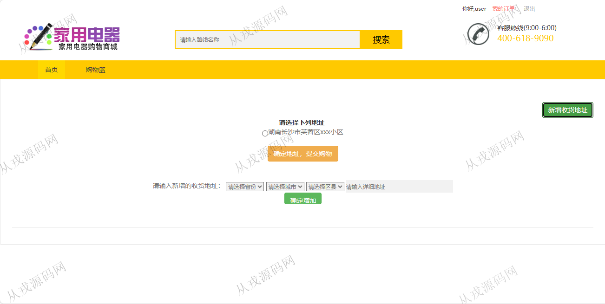
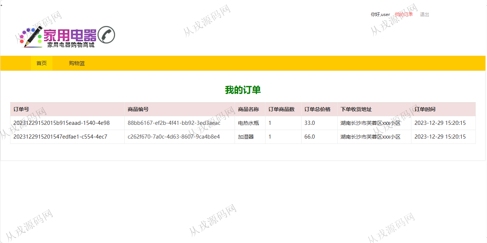
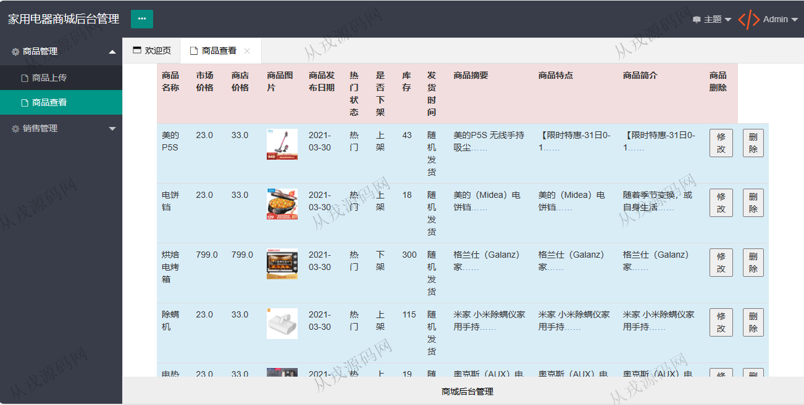
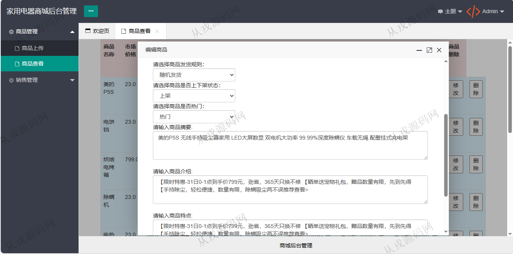
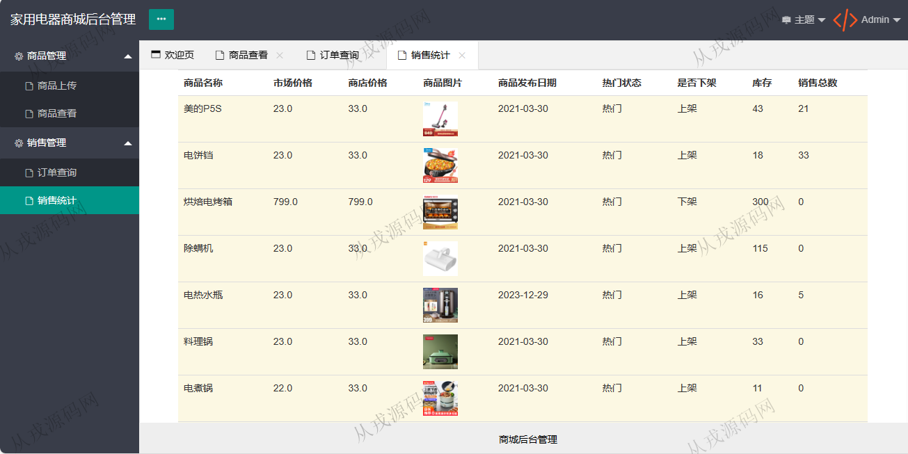

<h1 align="center">87.家用电器购物商城管理系统</h1>

 获取sql文件 QQ: 386869957 QQ群: 377586148 

 [推荐站点: 从戎源码网](https://armycodes.com/) 

## 简介

> 本代码来源于网络,仅供学习参考使用!
>
> 提供1.远程部署/2.修改代码/3.设计文档指导/4.框架代码讲解等服务
> 
> 管理后台：http://localhost:8080/admin/admin.jsp
> 
> 前台地址：http://localhost:8080/
> 
> 用户名密码：user 123456
>

## 项目介绍
基于jsp+servlet的家用电器购物商城管理系统：前端 jsp、jquery、layui，后端 servlet、jdbc，角色分为管理员、用户；集成商品管理、销售管理、商品购买、购物车，在线付款等功能于一体的系统。

## 功能介绍

### 管理员

- 商品管理：商品信息的增删改查，图片上传
- 销售管理：订单列表查询，销售统计，包含库存、销售数量、金额数据等

### 用户

- 基本功能：登录，注册、退出
- 网站首页：导航栏，轮播图，商城精选，昨日商品
- 商品购买：详情详情浏览，加入购物车，购物车提交购买，收货地址新增和选择，付款，提交订单
- 我的订单：订单列表查询

## 环境

- <b>IntelliJ IDEA 2021.3</b>

- <b>Mysql 5.7.26</b>

- <b>Maven</b>

- <b>JDK 1.8</b>

## 运行截图

